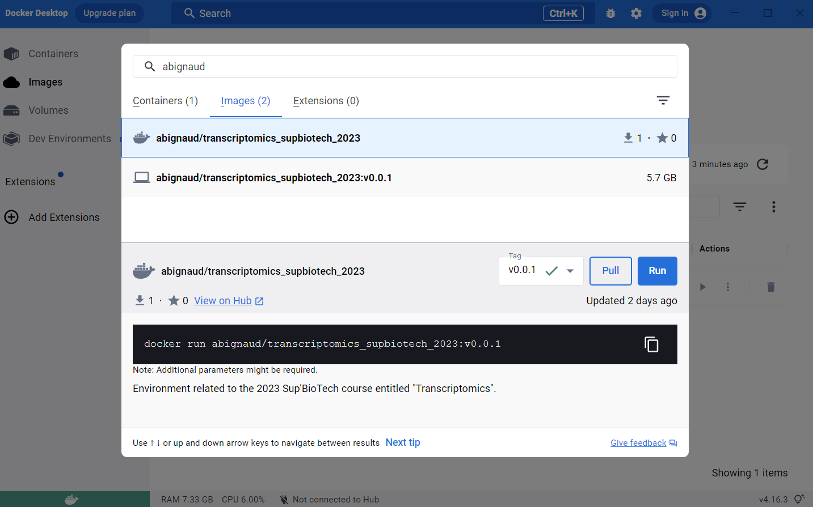
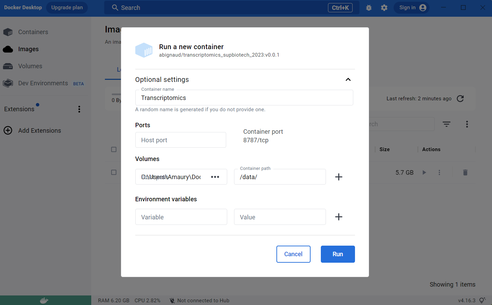

# Config
---
## Unzipped the archive with the dataset

Download the archive file from the link you have received by email.

The `.tar` file is an archive. It means it's a folder which has been compressed and grouped in one file lighter which is easy to share.

To extract the archive you can use the `tar` command. I won't go in detail about that command, just `-x` is for open, `-v` for verbose (more stuff print on your screen), `-z` for unzipped as it is compressed with gzip (`.gz` extension) and `-f FILE` to give the archive file to work with.

```sh
tar -xvzf genomics_supbiotech_2023.tar.gz
cd genomics_supbiotech_2023
ls
```

Congratulations you have the data !

---
## Install conda

```sh
# Using Linux (or Linus subsystem on Windows):
wget https://repo.anaconda.com/archive/Anaconda3-2023.07-2-Linux-x86_64.sh
bash Anaconda3-2023.07-2-Linux-x86_64.sh

# Without the M1 chip (your MAC is more than one year old - use this one if you don't know):
wget https://repo.anaconda.com/archive/Anaconda3-2023.07-2-MacOSX-x86_64.sh
bash Anaconda3-2023.07-2-MacOSX-x86_64.sh

# With the M1 chip (your MAC is ~ one year old):
wget https://repo.anaconda.com/archive/Anaconda3-2023.07-2-MacOSX-arm64.sh
bash Anaconda3-2023.07-2-MacOSX-arm64.sh
```

- Then press `ENTER`
- Read all the terms of utilisation (or maintain enter to skip it)
- Accept the terms of License by writing `yes` and press `ENTER`
- Press `ENTER` to confirm the location of installation
- Wait during the installation
- Accept to install the initializer by writing `yes` and press `ENTER`
- Congratulations `conda` is installed !

---
## Install your conda environnement

- Run the initializer to add `conda` as a command (Openning a new terminal would have done the job too)
- Go in the genomics_supbiotech_2023 folder 
- Get the `yaml` environment file from the `github` repository
- Install the conda environment

```sh
source .bashrc 
cd genomics_supbiotech_2023
wget https://github.com/ABignaud/Genomics_SupBioTech_2023/raw/main/genomics.yaml
conda env create -f genomics.yaml
conda activate genomics
```
---
## Install IGV 

For the Session 2,
[Integrative Genomics Viewer (IGV)](https://software.broadinstitute.org/software/igv/) will be needed. To install it go to the following page to download the executable according to your system and run it:

https://software.broadinstitute.org/software/igv/download

---
## Install docker-desktop

This was a first attempt to have the same environnement but it's really, really painful to use and not that simple to use so don't use that. If you still want to use that and very bold and want a painful interface you can play with that, it should work. 
But in brief: **Don't do try to install it except you have a very good reason !!**

Downloads the executable
https://www.docker.com/products/docker-desktop/


### To install it on Mac:
https://docs.docker.com/desktop/install/mac-install/

### To install it on Windows:
https://docs.docker.com/desktop/install/windows-install/

For Windows, you will probably encounter an issue with WSL at the end of the installation. Here are the instructions to install it:

https://learn.microsoft.com/en-us/windows/wsl/install 

### To install it on Linux/
https://docs.docker.com/desktop/install/linux-install/


## Install the docker image

A `docker` image is an image of a computer with some software installed on it. 
Basically, by pulling and running the image you will locally install that 
computer on your computer and all of you will work exactly on the same machine.

To install go the search bar at the top and search for 
`abignaud/transcriptomics_supbiotech_2023`, search for an `image` and then pull
it. It will take a little time to download (few GB as there are the whole OS for
the computer). If you don't find the image, try to search just `abignaud` or 
with only the part of the name.



## Run the docker image

Create a `directory` where you want to store the files for the analysis.
Download the archive file in that directory (the link is in the email you 
received). 

Then go the image stuff. You should have a new image.

Run it and use the advanced settings:
- Select a name for the container (Transcriptomics_SupBioTech_2023 for example)
- Select the `directory` you created earlier as a host path
- Choose `/data/` as container path.



## Open terminal

Do not do this part if it's not working.

Now open the terminal (3rd panel). If you didn't manage to do that step, it's 
ok.

For some reason, it seems that you may have to leave the mounted repository to 
be able to assess the files in it. To do that enter these commands.

```sh
cd ..
cd data
ls 
```

The `ls` should yield you the list of the files inside your folder. So the
archive that you previously downloaded should be listed. If not, it's not 
working. Check that you have loaded the right folder in the advanced settings 
used.

Open the archive file, by entering that command:

`tar -xvzf transcriptomics_supbiotech_2023.tar.gz`

Congratulations your environment is set up !


