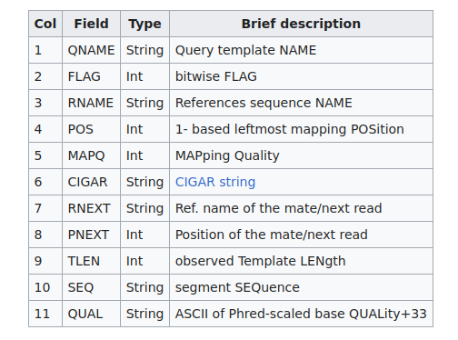

---
title: "Sequence alignment"
output: 
    rmdformats::readthedown: 
        highlight: tango
        preserve_yaml: true
        df_print: tibble
        toc_depth: 4
        css: ./assets/custom.css
---

In this practice session, we go through the process of aligning sequencing data
The goal of this analysis is to align our sequences on our reference genome to 
generate alignment tracks and visualize the transcription signal on the 
reference genome. 

For simplicity purposes, we will be using specialized tools command line in this
practice session, but all data manipulation steps can be performed or modified
using a scripting language. The tools that will be needed here are:

* [cutadapt](https://github.com/marcelm/cutadapt)
* [samtools](http://www.htslib.org/)
* [bowtie2](https://bowtie-bio.sourceforge.net/bowtie2/manual.shtml)
* [deeptools](https://github.com/deeptools/deepTools)
* [IGV](https://software.broadinstitute.org/software/igv/)

For the analysis we will use data from *Bacillus subtilis* culture infected by 
its phage SPP1 RNA-seq libraries. The reads are subsampled to accelerate the 
quality check. The reference genome from this library is the YB886 strain from
*Bacillus subtilis* and its phage SPP1.


All the data are available in the `genomics_supbiotech_2023/` folder.

## Trimming the adaptors

As we saw in the first session there were some adaptors sequences at the 
beginning of the reads. The solution is to trim the reads to remove these 
bases to avoid mapping issues as they were artificially added.

> Looking at the fastqc report from the previous session how much base pairs 
will you remove ?

<details><summary>**Answer:**</summary>
<p>
Looking at the per base sequence report, we can remove 8bp to be sure to remove 
all the adapters sequences.
</p>
</details>
<br>

To trim the sequence we will use [cutadapt](https://github.com/marcelm/cutadapt)
software. 

> Looking at the help menu of cutadapt what command do you propose to trim your 
reads ?

<details><summary>**Clue:**</summary>
<p>
```{sh eval = FALSE}
cutadapt --help
```
</p>
</details>
<br>

<details><summary>**Show code:**</summary>
<p>
```{sh eval = FALSE}
mkdir -p results/cutadapt/
cutadapt -u 8 -U 8 -q 33,33 --trim-n -m 20 -o results/cutadapt/Bacillus_infection_T0_R1_trimmed.fq.gz -p results/cutadapt/Bacillus_infection_T0_R2_trimmed.fq.gz fastq/Bacillus_infection_T0_R1.fq.gz fastq/Bacillus_infection_T0_R2.fq.gz
cutadapt -u 8 -U 8 -q 33,33 --trim-n -m 20 -o results/cutadapt/Bacillus_infection_T10_R1_trimmed.fq.gz -p results/cutadapt/Bacillus_infection_T10_R2_trimmed.fq.gz fastq/Bacillus_infection_T10_R1.fq.gz fastq/Bacillus_infection_T10_R2.fq.gz
```
</p>
</details>
<br>

Once is done you can launch a `fastqc` and `fastq-screen` again to see what have
changed. 

<details><summary>**Show code:**</summary>
<p>
```{sh eval = FALSE}
mkdir -p results/fastqc results/fastq_screen
fastqc -o results/fastqc results/cutadapt/*fq.gz 
fastq_screen --outdir results/fastq_screen --conf reference/fastq_screen.conf --force results/cutadapt/*fq.gz 
```
</p>
</details>
<br>

You saw that we have removed the biases at the beginning of the reads and select 
the reads with the highest quality. The length is not uniform now as some reads 
have been more trimmed than others. Finally, we have resolved the mapping issue
from the reverse reads.

## Aligning the sequences

Now that we have cleaned and well-prepared our sequences we can start our 
analysis. The first step is to align the reads on the reference genome. The most
known algorithms for mapping are `bowtie2`, `bwa` and `minimap`. There are also 
some others aligners more specific to RNA-seq such as `STAR` or `salmon`. For
bacteria where the genomes are small with no repeated regions, there are not 
necessary.

In this practical we will use 
[bowtie2](https://bowtie-bio.sourceforge.net/bowtie2/manual.shtml) as `bwa` and 
`minimap` are not well suited for very short reads (<100bp).

The aligner algorithm needs to index the fasta. An index will be like a 
dictionnary where the sequence present in the genome are sorted. It will allow 
to find the matching sequences very fast. To build the index using `bowtie2`
you can use `bowtie2-build` command. To simplify the analysis we will just look 
at the genome of the bacteria at T0.

<details><summary>**Clue:**</summary>
<p>
```{sh eval = FALSE}
bowtie2-build --help
```
</p>
</details>
<br>

<details><summary>**Show code:**</summary>
<p>
```{sh eval = FALSE}
mkdir -p reference/index
bowtie2-build reference/YB886.fa reference/index/YB886
```
</p>
</details>
<br>

Once the index is done we can use the `bowtie2` command to map the reads. We 
will use the `--very-sensitive` method. You can look at the 
[documentation](https://bowtie-bio.sourceforge.net/bowtie2/manual.shtml):

```{sh eval = FALSE}
bowtie2 --help
```

> What's the seed ?

<details><summary>**Answer:**</summary>
<p>
As trying to map a nicely to all sequence will be slow for the aligner, they 
used a subset of the sequence called seed to find first potential position, then 
they will extend that seed to find the best match. The seed is ste up by the 
`-L` parameter in bowtie2. The bigger the seed is the faster the algorithm is. 
Indeed it will have to extedn on less positions but it may missed the perfect 
position if it didn't take a perfect sequence as the seed.
</p>
</details>
<br>

> What's the `local` alignment mode ? Is it really useful in our case ?

<details><summary>**Answer:**</summary>
<p>
Opposed to `end-to-end` mode the `local` mode is a mode allowing the edges of 
the reads to not be mapped by the aligner. Is it usually advised to use it for
RNA-seq as there are some splicing which will introduce issues with local 
alignment. However, as it's not occuring in bacteria, it is not necessary for us 
to use it. 
</p>
</details>
<br>
 
Launch the alignment using bowtie2 paired end mode:

<details><summary>**Show code:**</summary>
<p>
```{sh eval = FALSE}
mkdir -p results/alignment
bowtie2 --very-sensitive --maxins 1000 -x reference/index/YB886 -1 results/cutadapt/Bacillus_infection_T0_R1_trimmed.fq.gz -2 results/cutadapt/Bacillus_infection_T0_R2_trimmed.fq.gz -S results/alignment/T0.sam
```
</p>
</details>
<br>

`Bowtie2` will return some alignment metrics. You see that you have more than 
95% of sequence mapped on the genome. 

> Why it's not 100% ?

<details><summary>**Answer:**</summary>
<p>
There are multiple answers to that question:
- You got contaminated by others DNA (another organism, vectors, adapters...). 
We checked this one so it will be less likely.
- There are some sequencing errors which introduce wrong sequence in your files, 
that you won't be able to map.
- There are mistakes in your reference genome or it's uncomplete.
</p>
</details>
<br>

> Try to map the reads of the second time point (T10). Do you have the same rate 
of mapping ? Why ?

<details><summary>**Answer:**</summary>
<p>
```{sh eval = FALSE}
bowtie2 --very-sensitive --maxins 1000 -x reference/index/YB886 -1 results/cutadapt/Bacillus_infection_T10_R1_trimmed.fq.gz -2 results/cutadapt/Bacillus_infection_T10_R2_trimmed.fq.gz -S results/alignment/T10.sam
```

The mapping alignment ratio is lower. In the second time point, there are a lot 
of reads which map on the phage (which is replicating) and not on the bacteria
anymore.
</p>
</details>
<br>


### The sam format output

Let's look at the output that we have. The `grep -v '^@'` command allows showing
lines that don't have a `@` at the beginning, in our case it allows to skip the
header.

```{sh eval = FALSE}
grep -v '^@' results/alignment/T0.sam | head -n 4
```

```
NS500446:543:HNM5TBGX7:1:11101:11655:1062       77      *       0       0       **0       0       GCAACAACATCATCTGCTANTTCTANTATTGATGANACCCTTA     EEEEEEEEEEEEAAEAEEE#EEAEE#EEAEEEEEA#EEE6E/E       YT:Z:UP
NS500446:543:HNM5TBGX7:1:11101:11655:1062       141     *       0       0       **0       0       CAGCTTCCTTTGCAANNTGCTGCTT       EEEEEEEAEAEAEEE##EEEEE/EE       YT:Z:UP
NS500446:543:HNM5TBGX7:1:11101:13459:1063       77      *       0       0       **0       0       GGTGAACTTCACCTTGATANCATTGNTGACCGTATNAAACGCG     EEEEEEEEEEEEEEEEEEE#EEEEE#EEEEEEEEE#EEEEEEE       YT:Z:UP
NS500446:543:HNM5TBGX7:1:11101:13459:1063       141     *       0       0       **0       0       AGCTGGGATGTATTCACNNGGAACGAC     EEEEEEEEEEEEEEEEE##EEEEEEEE     YT:Z:UP
NS500446:543:HNM5TBGX7:1:11101:21545:1063       83      manual_scaffold_1       1527086   42      43M     =       1526863 -266    TATAATANAATTTTACCNTATTTNAGGAGGGAGTTGAATTTTT       EEEEEAE#EEEEEEEEE#EEEAE#EEEEE/EEEEEEEEEEEEE     AS:i:-3 XN:i:0  XM:i:3    XO:i:0  XG:i:0  NM:i:3  MD:Z:7A9A5A19   YS:i:-1 YT:Z:CP
NS500446:543:HNM5TBGX7:1:11101:21545:1063       163     manual_scaffold_1       1526863   42      26M     =       1527086 266     ACGTGAATAATATATACNTCCTAGAT      EEEEEEEE/EEEEEEEE#EEAEEEEE        AS:i:-1 XN:i:0  XM:i:1  XO:i:0  XG:i:0  NM:i:1  MD:Z:17T8 YS:i:-3 YT:Z:CP
NS500446:543:HNM5TBGX7:1:11101:5515:1064        99      manual_scaffold_1       3635839   42      23M     =       3635918 106     GTTTTATTTTAAATTCTCCTCAA EEEEEEEEEEEEA/EEEEEEEEE   AS:i:0  XN:i:0  XM:i:0  XO:i:0  XG:i:0  NM:i:0  MD:Z:23 YS:i:-1 YT:Z:CP
NS500446:543:HNM5TBGX7:1:11101:5515:1064        147     manual_scaffold_1       3635918   42      27M     =       3635839 -106    CTTGGTGTGNATTCCTTGTCTTCTTTT     EEEEEEEEE#EEEEEEEEE66EEEEEE       AS:i:-1 XN:i:0  XM:i:1  XO:i:0  XG:i:0  NM:i:1  MD:Z:9A17 YS:i:0  YT:Z:CP
NS500446:543:HNM5TBGX7:1:11101:19648:1065       83      manual_scaffold_1       272545    42      43M     =       272509  -79     AGCGCTTNGGCCACAGAAACCGGAAGAACCTCTCCGCAAAACA       EEEEEEE#EEEEEEEEEEEEEEEEEEEEEEEEEEEEEEEEEEE     AS:i:-1 XN:i:0  XM:i:1    XO:i:0  XG:i:0  NM:i:1  MD:Z:7T35       YS:i:-1 YT:Z:CP
NS500446:543:HNM5TBGX7:1:11101:19648:1065       163     manual_scaffold_1       272509    42      27M     =       272545  79      GTATTAAAAATCTTCGCNTTCGGAAAA     EEEEEEEEEEEEEEEEE#EEEEEEEEE       AS:i:-1 XN:i:0  XM:i:1  XO:i:0  XG:i:0  NM:i:1  MD:Z:17T9 YS:i:-1 YT:Z:C
```

The file is a `sam` file, which is a tab separated file of 11 columns:

```{r, out.width="100%",  fig.cap="Sam file format", echo=FALSE}

```

The column that interest us especially is the position of the reads on the 
reference, the flag, information about the mapping and the mapping quality, 
how much a sequence is unique in the reference. 

To see what a flag means, we can use that: 
https://broadinstitute.github.io/picard/explain-flags.html

> Using it try to explain the different following flags 77, 141, 83, 163, 99, 
147.

The sam file is quite heavy, as for the fastq we are used to work with 
compressed files. We will at the same time filter the mapping reads, sort them
and index them using `samtools`. The `bam` file is the compressed version of
`sam`.

<details><summary>**Bonus:**</summary>
<p>
Use the following command:
```{sh eval = FALSE}
samtools --help
``` 

```
Program: samtools (Tools for alignments in the SAM format)
Version: 1.3.1 (using htslib 1.3.1)

Usage:   samtools <command> [options]

Commands:
  -- Indexing
     dict           create a sequence dictionary file
     faidx          index/extract FASTA
     index          index alignment

  -- Editing
     calmd          recalculate MD/NM tags and '=' bases
     fixmate        fix mate information
     reheader       replace BAM header
     rmdup          remove PCR duplicates
     targetcut      cut fosmid regions (for fosmid pool only)
     addreplacerg   adds or replaces RG tags

  -- File operations
     collate        shuffle and group alignments by name
     cat            concatenate BAMs
     merge          merge sorted alignments
     mpileup        multi-way pileup
     sort           sort alignment file
     split          splits a file by read group
     quickcheck     quickly check if SAM/BAM/CRAM file appears intact
     fastq          converts a BAM to a FASTQ
     fasta          converts a BAM to a FASTA

  -- Statistics
     bedcov         read depth per BED region
     depth          compute the depth
     flagstat       simple stats
     idxstats       BAM index stats
     phase          phase heterozygotes
     stats          generate stats (former bamcheck)

  -- Viewing
     flags          explain BAM flags
     tview          text alignment viewer
     view           SAM<->BAM<->CRAM conversion
     depad          convert padded BAM to unpadded BAM
```

You see that samtools is package containing several modules to work with `sam`,  
`fasta` and others alignment files.

For example, there is a module for the flag explanation that we checked earlier 
online. But you can also do a lot of operation and statistics on your alignment 
files.

If you want to use one of this module you have to call it using 
`samtools flags --help`. In that case you will have the documentation of the 
flags module.
</p>
</details>
<br>


```{sh eval = FALSE}
# Sort and compressed the sam file.
samtools sort -n -O BAM results/alignment/T0.sam -o T0_tmp1.bam
# Keep only pairs with both reads mapped.
samtools fixmate --output-fmt bam T0_tmp1.bam T0_tmp2.bam
# Filter reads with low mapping quality.
samtools view --output-fmt bam -f 2 -q 30 -1 -b T0_tmp2.bam -o T0_tmp1.bam
# Sort the resulting reads.
samtools sort --output-fmt bam -l 9 T0_tmp1.bam -o results/alignment/T0_sorted.bam
# Index the reads
samtools index results/alignment/T0_sorted.bam
# Remove the sam files and the temporary files.
rm results/alignment/T0.sam T0_tmp1.bam T0_tmp2.bam
```

The `rm` function allow removing files through the command lines. Be careful 
with this one, it's permanent deletion.

## Generating the transcription tracks

Once you align the reads you want to compute the coverage on your genome at each 
sequence of interest, genes in our case. To do that we will use the 
`bamCoverage` function from [deeptools](https://github.com/deeptools/deepTools).

```{sh eval = FALSE}
mkdir -p results/tracks
bamCoverage --bam results/alignment/T0_sorted.bam --outFileName results/tracks/T0_unstranded.bw --binSize 1 --normalizeUsing CPM --extendReads --ignoreDuplicates
bamCoverage --bam results/alignment/T0_sorted.bam --outFileName results/tracks/T0_forward.bw --binSize 1 --normalizeUsing CPM --extendReads --filterRNAstrand forward --ignoreDuplicates
bamCoverage --bam results/alignment/T0_sorted.bam --outFileName results/tracks/T0_reverse.bw --binSize 1 --normalizeUsing CPM --extendReads --filterRNAstrand reverse --ignoreDuplicates
```

The output files are `bigwig` which are compress files with coverage of a 
genomic track. 

> What's the `extendReads` option ?

<details><summary>**Answer:**</summary>
<p>
As we have a pair file, the `extendreads` option will just use also the sequence
between the forward and reverse to compute the coverage.
</p>
</details>
<br>

> What does CPM mean ? Why are we using that normalization ?

<details><summary>**Answer:**</summary>
<p>
CPM means Count Per Millions. The idea of that normalization is to get rid of 
the difference between the numbers of mapping reads in a library (Sequencing 
twice more will yield twice more coverage otherwise).
</p>
</details>
<br>

> What is the point to filter the reads based on their strand in a RNA-seq and 
to generate two tracks ?

<details><summary>**Answer:**</summary>
<p>
We did a stranded library, so we can generate a forward and reverse tracks which
are both biologically relevant. Filtering the strand allows to generate the two 
tracks separately.
</p>
</details>
<br>

## Visualizing the alignment using IGV

Now let's visualize our tracks using IGV. In IGV you can load the fasta genome
and then the sorted `bam`, `bigwig` or `gff`. The `gff` is the genome annotation 
file with the genes position.

For this step, you will have to download IGV on your own personal computer. Here
is the page where the installation file is available for each OS (Windows, Mac
or Linux).

https://software.broadinstitute.org/software/igv/download

Once it's downloaded you can open it. Load the bacterial `YB886` genome from the
reference folder and some `bw` files that you have generated. You can also load 
the gene annotation `gff` file. 

Now we can play around and explore your data. 

> Is it uniform ? 

<details><summary>**Answer:**</summary>
<p>
No. It's a RNA-seq, not a genomic DNA coverage.
</p>
</details>
<br>

> If you load the stranded files, Do you see antisens RNA (it means coverage in the 
opposite strand of the gene) ?

<details><summary>**Answer:**</summary>
<p>
There are some coverage, but it's very low. If you do the statistics, you will 
see that only 2-3% of the reads are antisens in these samples. For some species,
samples, there are a lot of antisens RNA but it's generally not more than 
10-20%.
</p>
</details>
<br>

> Looking at the strands of the genes on the whole genome (look at the tracks on
the forward and reverse strand), is it a uniform distribution or not  ? Based on 
your knowledge on bacteria, why do you think it's not uniform ?

<details><summary>**Answer:**</summary>
<p>
Mainly the first half of the genome the genes are in the forward strand and 
there are in reverse in the second one. The reason is the origin of replication 
of the bacteria is the beginning/end of the reference genome (the genome is 
circular so the beginning and the end of the reference is the same region). 
Evolution tends to select genes which are in the same direction as the 
replication of the DNA. So in the first half the replication goes in the forward 
way, and the genes too, and the contrary happens in the second half. 
</p>
</details>
<br>

