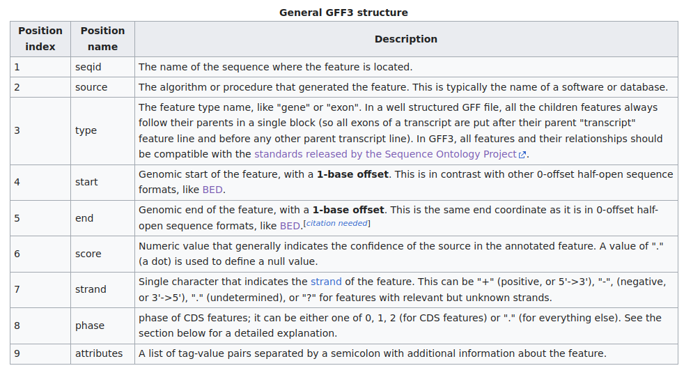
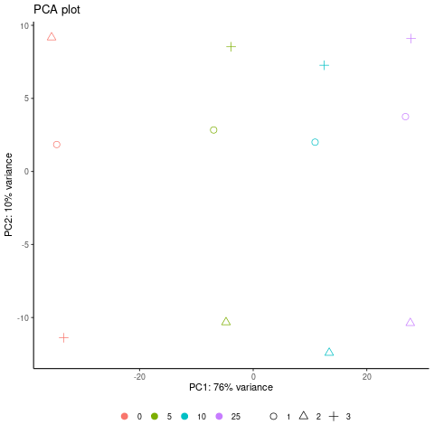
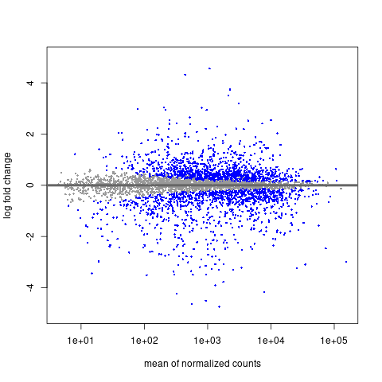
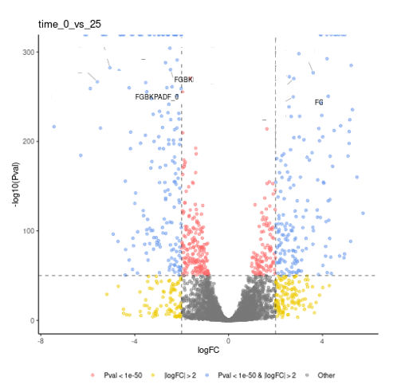
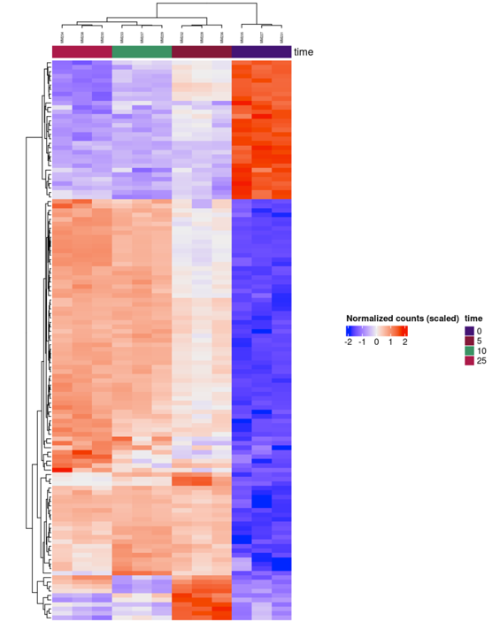

---
title: "Differential Gene Expression analysis"
output: 
    rmdformats::readthedown: 
        highlight: tango
        preserve_yaml: true
        df_print: tibble
        toc_depth: 4
        css: ./assets/custom.css
---

In this practice session, we go through the analysis of RNAseq data and the gene
differential expression analysis. In the prvious session, we saw the processing 
of the libraries from the quality check to the sequence alignement. The goal of 
this analysis is to evaluate the expression of the genes and to compare it 
across several samples.

For the analysis we will use data from *Bacillus subtilis* culture infected by 
its phage SPP1 RNA-seq libraries. The reference genome from this library is the
YB886 strain from *Bacillus subtilis* and its phage SPP1. In this one, the 
featureCount table I gave you has been computed based on all the reads. 
Furthermore, in this case you will have all the replicates for each samples. 
Thus, we have 3 replicates for each of the four time points ; 0, 5, 10, 25 
minutes. 

For simplicity purposes, I have done a R script which will run almost all the 
analysis. If you want to run it, you will have to install all the R packages 
first using the following command in a R terminal:

```{r eval = FALSE}
install.packages("dplyr")
install.packages("ggplot2")
install.packages("ggbeeswarm")
install.packages("ashr")
install.packages("hwriter")
install.packages("ini")
install.packages("ggrepel")
install.packages("png")
install.packages("circlize")
install.packages('BioManager')
BiocManager::install("DESeq2")
BiocManager::install("rhdf5")
BiocManager::install("tximport")
BiocManager::install("ReportingTools")
BiocManager::install("ComplexHeatmap")
```

You will also need the 
[featureCounts](https://doi.org/10.1093/bioinformatics/btt656) software for the
first step.

## Computing genes counts

The first step for a differential gene expression analysis is to count the 
numbers of reads/fragments mapping on a gene. To do it, we need to know the 
positions of the genes. Usually, you have genome annotation files made 
previously with the coding sequence position. In some case, you will have to 
generate them by yourself. You can use annotation workflow and then polish it by 
hand using your RNAseq data. In this case, I just run 
[prokka](https://github.com/tseemann/prokka) on the fasta genome. As other 
*Bacillus subtilis* has been pretty well annotated it yields a satisfying 
annotation.

### The gff format

The annotations are written in an annotation file. Here, we use a `gff` file 
format, however several others format exists. The main ones are `gff`, `gtf` and
`genbank`. `gff` and `gtf` are quite similar with one entry per annotation while
`genbank` has several lines for one annotation starting with a field. Here we 
will just discuss `gff`.

Let's just take a look at one of them:

```{sh eval = FALSE}
head -n 20 reference/YB886.gff 
```

```
##gff-version 3
##sequence-region manual_scaffold_1 1 4002542
...
...
##sequence-region manual_scaffold_16 1 108
manual_scaffold_1       Prodigal:002006 CDS     12197   14662   .       -       0       gene_id=FGBKPADF_00001;eC_number=5.6.2.2;Name=gyrA;db_xref=COG:COG0188;gene=gyrA;inference=ab initio prediction:Prodigal:002006,similar to AA sequence:UniProtKB:P05653;locus_tag=FGBKPADF_00001;product=DNA gyrase subunit A
manual_scaffold_1       Prodigal:002006 CDS     14873   16795   .       -       0       gene_id=FGBKPADF_00002;eC_number=5.6.2.2;Name=gyrB;db_xref=COG:COG0187;gene=gyrB;inference=ab initio prediction:Prodigal:002006,similar to AA sequence:UniProtKB:Q839Z1;locus_tag=FGBKPADF_00002;product=DNA gyrase subunit B
manual_scaffold_1       Prodigal:002006 CDS     16844   17089   .       -       0       gene_id=FGBKPADF_00003;inference=ab initio prediction:Prodigal:002006;locus_tag=FGBKPADF_00003;product=hypothetical protein
```

The `gff` file is composed of a header with lines starting with `##`. In the 
header you will usually find the version of the `gff` format and the sequence 
names and length of the original fasta. Then you have the annotation with one 
line per annotation. Each line have 9 columns as described in the table below:


```{r, out.width="100%",  fig.cap="GFF file format", echo=FALSE}

```

The last one is a column where you can add any additional field. Some pipelines 
will need a specific field added here to work. That's the case of
`featureCounts` which need a `gene_id` field to work.

### Running featureCounts

Now that we have our annotation we can launch the `featureCounts` software. As 
usual launch the help of `featureCounts` to see how to use it.

<details><summary>**Clue:**</summary>
<p>
```{sh eval = FALSE}
featureCounts --help
```
</p>
</details>
<br>

<details><summary>**Output:**</summary>
<p>
```
Version 2.0.3

Usage: featureCounts [options] -a <annotation_file> -o <output_file> input_file1 [input_file2] ... 

## Mandatory arguments:

  -a <string>         Name of an annotation file. GTF/GFF format by default. See
                      -F option for more format information. Inbuilt annotations
                      (SAF format) is available in 'annotation' directory of the
                      package. Gzipped file is also accepted.

  -o <string>         Name of output file including read counts. A separate file
                      including summary statistics of counting results is also
                      included in the output ('<string>.summary'). Both files
                      are in tab delimited format.

  input_file1 [input_file2] ...   A list of SAM or BAM format files. They can be
                      either name or location sorted. If no files provided,
                      <stdin> input is expected. Location-sorted paired-end reads
                      are automatically sorted by read names.

## Optional arguments:
# Annotation

  -F <string>         Specify format of the provided annotation file. Acceptable
                      formats include 'GTF' (or compatible GFF format) and
                      'SAF'. 'GTF' by default.  For SAF format, please refer to
                      Users Guide.

  -t <string>         Specify feature type(s) in a GTF annotation. If multiple
                      types are provided, they should be separated by ',' with
                      no space in between. 'exon' by default. Rows in the
                      annotation with a matched feature will be extracted and
                      used for read mapping. 

  -g <string>         Specify attribute type in GTF annotation. 'gene_id' by 
                      default. Meta-features used for read counting will be 
                      extracted from annotation using the provided value.

  --extraAttributes   Extract extra attribute types from the provided GTF
                      annotation and include them in the counting output. These
                      attribute types will not be used to group features. If
                      more than one attribute type is provided they should be
                      separated by comma.

  -A <string>         Provide a chromosome name alias file to match chr names in
                      annotation with those in the reads. This should be a two-
                      column comma-delimited text file. Its first column should
                      include chr names in the annotation and its second column
                      should include chr names in the reads. Chr names are case
                      sensitive. No column header should be included in the
                      file.

# Level of summarization

  -f                  Perform read counting at feature level (eg. counting 
                      reads for exons rather than genes).

# Overlap between reads and features

  -O                  Assign reads to all their overlapping meta-features (or 
                      features if -f is specified).

  --minOverlap <int>  Minimum number of overlapping bases in a read that is
                      required for read assignment. 1 by default. Number of
                      overlapping bases is counted from both reads if paired
                      end. If a negative value is provided, then a gap of up
                      to specified size will be allowed between read and the
                      feature that the read is assigned to.

  --fracOverlap <float> Minimum fraction of overlapping bases in a read that is
                      required for read assignment. Value should be within range
                      [0,1]. 0 by default. Number of overlapping bases is
                      counted from both reads if paired end. Both this option
                      and '--minOverlap' option need to be satisfied for read
                      assignment.

  --fracOverlapFeature <float> Minimum fraction of overlapping bases in a
                      feature that is required for read assignment. Value
                      should be within range [0,1]. 0 by default.

  --largestOverlap    Assign reads to a meta-feature/feature that has the 
                      largest number of overlapping bases.

  --nonOverlap <int>  Maximum number of non-overlapping bases in a read (or a
                      read pair) that is allowed when being assigned to a
                      feature. No limit is set by default.

  --nonOverlapFeature <int> Maximum number of non-overlapping bases in a feature
                      that is allowed in read assignment. No limit is set by
                      default.

  --readExtension5 <int> Reads are extended upstream by <int> bases from their
                      5' end.

  --readExtension3 <int> Reads are extended upstream by <int> bases from their
                      3' end.

  --read2pos <5:3>    Reduce reads to their 5' most base or 3' most base. Read
                      counting is then performed based on the single base the 
                      read is reduced to.

# Multi-mapping reads

  -M                  Multi-mapping reads will also be counted. For a multi-
                      mapping read, all its reported alignments will be 
                      counted. The 'NH' tag in BAM/SAM input is used to detect 
                      multi-mapping reads.

# Fractional counting

  --fraction          Assign fractional counts to features. This option must
                      be used together with '-M' or '-O' or both. When '-M' is
                      specified, each reported alignment from a multi-mapping
                      read (identified via 'NH' tag) will carry a fractional
                      count of 1/x, instead of 1 (one), where x is the total
                      number of alignments reported for the same read. When '-O'
                      is specified, each overlapping feature will receive a
                      fractional count of 1/y, where y is the total number of
                      features overlapping with the read. When both '-M' and
                      '-O' are specified, each alignment will carry a fractional
                      count of 1/(x*y).

# Read filtering

  -Q <int>            The minimum mapping quality score a read must satisfy in
                      order to be counted. For paired-end reads, at least one
                      end should satisfy this criteria. 0 by default.

  --splitOnly         Count split alignments only (ie. alignments with CIGAR
                      string containing 'N'). An example of split alignments is
                      exon-spanning reads in RNA-seq data.

  --nonSplitOnly      If specified, only non-split alignments (CIGAR strings do
                      not contain letter 'N') will be counted. All the other
                      alignments will be ignored.

  --primary           Count primary alignments only. Primary alignments are 
                      identified using bit 0x100 in SAM/BAM FLAG field.

  --ignoreDup         Ignore duplicate reads in read counting. Duplicate reads 
                      are identified using bit Ox400 in BAM/SAM FLAG field. The 
                      whole read pair is ignored if one of the reads is a 
                      duplicate read for paired end data.

# Strandness

  -s <int or string>  Perform strand-specific read counting. A single integer
                      value (applied to all input files) or a string of comma-
                      separated values (applied to each corresponding input
                      file) should be provided. Possible values include:
                      0 (unstranded), 1 (stranded) and 2 (reversely stranded).
                      Default value is 0 (ie. unstranded read counting carried
                      out for all input files).

# Exon-exon junctions

  -J                  Count number of reads supporting each exon-exon junction.
                      Junctions were identified from those exon-spanning reads
                      in the input (containing 'N' in CIGAR string). Counting
                      results are saved to a file named '<output_file>.jcounts'

  -G <string>         Provide the name of a FASTA-format file that contains the
                      reference sequences used in read mapping that produced the
                      provided SAM/BAM files. This optional argument can be used
                      with '-J' option to improve read counting for junctions.

# Parameters specific to paired end reads

  -p                  Specify that input data contain paired-end reads. To
                      perform fragment counting (ie. counting read pairs), the
                      '--countReadPairs' parameter should also be specified in
                      addition to this parameter.

  --countReadPairs    Count read pairs (fragments) instead of reads. This option
                      is only applicable for paired-end reads.

  -B                  Only count read pairs that have both ends aligned.

  -P                  Check validity of paired-end distance when counting read 
                      pairs. Use -d and -D to set thresholds.

  -d <int>            Minimum fragment/template length, 50 by default.

  -D <int>            Maximum fragment/template length, 600 by default.

  -C                  Do not count read pairs that have their two ends mapping 
                      to different chromosomes or mapping to same chromosome 
                      but on different strands.

  --donotsort         Do not sort reads in BAM/SAM input. Note that reads from 
                      the same pair are required to be located next to each 
                      other in the input.

# Number of CPU threads

  -T <int>            Number of the threads. 1 by default.

# Read groups

  --byReadGroup       Assign reads by read group. "RG" tag is required to be
                      present in the input BAM/SAM files.
                      

# Long reads

  -L                  Count long reads such as Nanopore and PacBio reads. Long
                      read counting can only run in one thread and only reads
                      (not read-pairs) can be counted. There is no limitation on
                      the number of 'M' operations allowed in a CIGAR string in
                      long read counting.

# Assignment results for each read

  -R <format>         Output detailed assignment results for each read or read-
                      pair. Results are saved to a file that is in one of the
                      following formats: CORE, SAM and BAM. See Users Guide for
                      more info about these formats.

  --Rpath <string>    Specify a directory to save the detailed assignment
                      results. If unspecified, the directory where counting
                      results are saved is used.

# Miscellaneous

  --tmpDir <string>   Directory under which intermediate files are saved (later
                      removed). By default, intermediate files will be saved to
                      the directory specified in '-o' argument.

  --maxMOp <int>      Maximum number of 'M' operations allowed in a CIGAR
                      string. 10 by default. Both 'X' and '=' are treated as 'M'
                      and adjacent 'M' operations are merged in the CIGAR
                      string.

  --verbose           Output verbose information for debugging, such as un-
                      matched chromosome/contig names.

  -v                  Output version of the program.
```
</p>
</details>
<br>

Here is the command line that we will be using to launch `featureCounts`:

```{sh eval = FALSE}
mkdir -p results/featureCounts
featureCounts \
    -p \
    -O \
    -s 1 \
    -t CDS \
    --ignoreDup \
    -T 1 \
    -G reference/YB886.fa \
    -a reference/YB886.gff \
    -o results/featureCounts/tmp_counts.txt \
    results/alignment/T0_sorted.bam results/alignment/T10_sorted.bam
# The following commands are just making a nicer table header.
FILE_PATH=results/alignment/
sed -i "s|$FILE_PATH||g" results/featureCounts/tmp_counts.txt
sed 's/_sorted.bam//g' results/featureCounts/tmp_counts.txt > results/featureCounts/featureCounts.txt
rm results/featureCounts/tmp_counts.txt
```

> What does the `-O` option mean ?

<details><summary>**Answer:**</summary>
<p>
The option means taht if a read overlap on two (or more) different features 
(CDS) in our case, it will be counted twice (or more). We accept that as in 
bacteria genes could be organized in operon and a same RNA can overlap multiple 
genes. While it happens, we stil want to count it for both genes.
</p>
</details>
<br>

> What does the `-s 1` option mean ?

<details><summary>**Answer:**</summary>
<p>
This options means that the library is stranded. As we saw in the alignment 
files, the reads map in the same way the strandness of the genes. Indead, during
the RNA sequencing, we kept the information of the strandness of the RNA. By 
giving this option, we ask to only to only count reads which only on a proper 
strand of the genome.
</p>
</details>
<br>

Let's look at the output file:

```{sh eval = FALSE}
head -n 6 results/featureCounts/featureCounts.txt
```

```
# Program:featureCounts v2.0.3; Command:"featureCounts" "-p" "-O" "-s" "1" "-t" "CDS" "--ignoreDup" "-T" "1" "-G" "reference/YB886.fa" "-a" "reference/YB886.gff" "-o" "test.txt" "T0" "T10" 
Geneid  Chr     Start   End     Strand  Length  T0      T10
FGBKPADF_00001  manual_scaffold_1       12197   14662   -       2466    4       12
FGBKPADF_00002  manual_scaffold_1       14873   16795   -       1923    2       6
FGBKPADF_00003  manual_scaffold_1       16844   17089   -       246     0       3
FGBKPADF_00004  manual_scaffold_1       17107   18219   -       1113    20      9
```

Here we have just a table with gene name, position and length. Then we have the 
integer count for each sample. The values are quite low here as it comes from 
the subsampled libraries.

For the next part we will be using the featureCounts file I provided to you 
which contains count for all library without subsampling. 

## Differential Gene expression analysis

### Running DESeq2

To run DESeq2, we could do all the step that I show you in the lecture, but 
there is a very nice R package which will handle all the works. To make it works 
you just need to give the gene count table and a metadata file describing all 
the conditions.

Here is the description of our libraries (basically the content of our metadata
file):

|Library ID|Time|Replicates|
|:-:|:-:|:-:|
|MM227|0|1|
|MM228|8|1|
|MM229|13|1|
|MM230|25|1|
|MM231|0|2|
|MM232|8|2|
|MM233|13|2|
|MM234|25|2|
|MM235|0|3|
|MM236|8|3|
|MM237|13|3|
|MM238|25|3|

DESeq2 R package will handle the statistics from the replicates and control (no 
control in our case), that's why we need to provide him the metadata.

<details><summary>**Bonus: looking at the Rscript**</summary>
<p>
If you look at the script, you will se that most of it is about plotting some 
plots to assess the quality of the analysis. The beginning is about parsing the 
metadata and prepare it for DESeq package and here are the part where we 
actually run DESeq2.


```{R eval = FALSE}
#-----------------------------------------------------------------------
#- Get counts and create dds
#-----------------------------------------------------------------------
dds <- DESeqDataSetFromMatrix(
    countData = countData,
    colData = colData,
    design = eval(parse(text = paste0("~ ", design)))
)

#-------------------------------------------
#- remove genes with <= 60 counts in all samples
#-------------------------------------------
dds <- dds[rowSums(counts(dds)) > 60, ]

#---------
#- Run DGE
#----------
dds <- DESeq(dds)

#---------
```

> Why do you think we removed genes with low count copy in all samples ?

<details><summary>**Answer:**</summary>
<p>
A gene with only a few reads mapping on it will have very large variations in 
fold change. A gene with one read mapping at T0 will have a fold change of 3 if
there is 3 reads at 5 minutes. This low amount reads can be either signal of a 
lowly transcribed genes which may be significant. However, there is a big chance
that it's just some fluctuation of noise signal. 
</p>
</details>
<br>

</p>
</details>
<br>

```{sh eval = FALSE}
Rscript deseq.r
```

Once the script has run, you will have some plots as output and one table. In
the table you will the gene expression values for each genes. But let's focus 
first on the plot which give an idea of the results of the global change in gene
expression. 

### The PCA plot

PCA stands for Principle Component Analysis. It's a dimensionality-reduction 
method. The idea is to transform a large dataset with plenty of dimensions to a
smaller dataset of a few dimensions. The idea is to look at the values of each 
dimension (each gene expression values in our case), look at the variance 
between the samples, and compute new dimensions which are combinations of the 
original ones. The dimension are made to explain most of the variance between 
samples with the first ones. So, hopefully looking at the first 
dimensions/components we can evaluate the variance across our samples.

Here is the PCA plot of our sample:

```{r, out.width="100%",  fig.cap="PCA plot", echo=FALSE}

```

> What can we deduce from this plot ?

<details><summary>**Answer:**</summary>
<p>
First, we saw that there is more variance between conditions than between 
replicates (second component explained less variance). This is reassuring, 
showing that we will be able to see actual difference in our samples, and that
the phage infection is impacting the bacteria.

Secondly, the second PCA component seems to explain the noise between 
replicates. We should be careful about the replicates as there are showing some 
variance.
</p>
</details>
<br>

### The MA plot

The MA plot stands for mean average plot. On the x-axis you have the mean 
average count and in the y-axis you have the log fold change between two 
experiments. This plot is a quality check. The dots are colored if they are 
considered as significant (p-value below a given threshold). The p-value will 
depend on the variance between two conditions and the one inside each condition.
Thus, a high p-value (grey dot) can be due by either no variance between two 
conditions, or a high variance inside one condition. Basically if the replicates
 are perfects, there shouldn't be any overlap between blue and grey dots.

```{r, out.width="100%",  fig.cap="MA plot", echo=FALSE}

```

> Do you think the replicates are ok based on these plots ? 

<details><summary>**Answer:**</summary>
<p>
Replicates seems ok for both conditions, there are no huge overlap between 
significant and not significant dots.
</p>
</details>
<br>

> Why the grey area is bigger at low mean of normalized counts ? 

<details><summary>**Answer:**</summary>
<p>
The noise is bigger for low signal, thus to be consider as significant you need  
a bigger fold change to overcome the noise variance.
</p>
</details>
<br>

### The Volcano plot

The volcano plot is called like that due to the shape of the plot. It's a plot 
of the fold change depending on the p-value. The plot allows separating 
differentially expressed genes from the others. The idea is two used two 
thresholds, a p-value threshold where we said that the log fold change seen is 
relevant and significantly different from 0 and one on the fold change to say 
that the variation is big enough.

Then the two interesting parts are the upper left panel which represents the 
down-regulated genes (fold change is negative) and the upper right panel which 
represents the up-regulated genes. 

```{r, out.width="100%",  fig.cap="MA plot", echo=FALSE}

```

> What are the meaning of the colors ? 

<details><summary>**Answer:**</summary>
<p>

- Grey: No significant small fold change. Normal genes with no differential 
expression.
- Yellow: Huge fold change but not significant. Genes quite noisy between 
replicates and conditions.
- Red: Significant small fold change. Significantly differentially expressed 
genes but with only small variation. We don't keep them as may have only a small 
biological relevance as their variations are small.  
- Blue: Huge significant fold change. Significantly differentially expressed 
genes with huge variation which are relevant.
</p>
</details>
<br>

> Check a volcano plot between two replicates. How many genes are differentially 
expressed ?

<details><summary>**Answer:**</summary>
<p>
0. 
</p>
</details>
<br>

### Heatmap

The heatmap is a plot where we look at the counts of the significantly 
differentially expressed genes across the conditions. It allows seeing if there 
are different populations of genes among the significant ones.

```{r, out.width="100%",  fig.cap="Heatmap", echo=FALSE}

```

> Do you see different populations inside that heatmap ?

<details><summary>**Answer:**</summary>
<p>
We are seeing three populations:

- Genes down-regulated across time
- Genes up-regulated across time
- Genes up-regulated at 5 minutes and down regulated after.
</p>
</details>
<br>

## What to do next ? 

The next step is where we start to do biology again. All the previous steps were
informatics except the fact that the objects were from biology. In the next step
we will have to check the relevance and the functions of the differentially 
expressed genes.

In order to do that you can use:

- Gene set enrichment analysis to look for differentially expressed pathways. 
- Bibliography research to look if the differentially expressed genes could have
been expected. 
- Functions research for hypothetical proteins, using folding prediction 
([Alphafold](https://alphafold.ebi.ac.uk/)), search for homology (hmm model 
search)...
- Do actual biology by mutating genes to see the impact.
- Compare with others genomics tracks if some are available.
